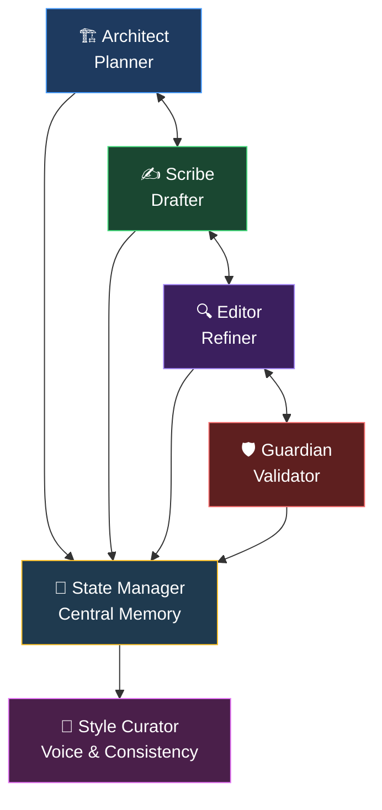

<div align="center">

<h1>🎭 Novel OS</h1>
<h3>A Production-Grade Multi-Agent Fiction Writing Framework</h3>

<p><em>Write novels like a professional author — with an entire editorial team at your command.</em></p>

<br/>

[](https://python.org)
[](LICENSE)
[]()
[]()

<br/>

```
╔══════════════════════════════════════════════════════════════════╗
║                                                                  ║
║   "The difference between an amateur and a professional          ║
║    writer is a systematic process."                              ║
║                                                                  ║
║                              — Novel OS Philosophy               ║
╚══════════════════════════════════════════════════════════════════╝
```

</div>

---

## 🌟 What is Novel OS?

**Novel OS** is not just a writing tool — it's a complete **editorial infrastructure** for producing professional-quality novels using multiple specialized AI agents working in concert.

Traditional AI writing generates one response and forgets everything. Novel OS is different. It builds a **persistent, intelligent writing environment** where:

- 🧠 **Everything is remembered** — characters, timelines, world rules, plot threads
- 🤝 **Agents collaborate** — each specialist hands off to the next with full context
- 🛡️ **Quality is enforced** — no chapter advances until it passes multiple gates
- 🎯 **Consistency is guaranteed** — automated fact-checking catches every contradiction

> Think of it like hiring a **full-time editorial team**: a story architect, a prose craftsman, a line editor, a fact-checker, and a voice coach — all working on your novel simultaneously, around the clock.

---

## 🏛️ Architecture at a Glance



---

## 🧠 Core Philosophy

| ❌ Traditional AI Writing | ✅ Novel OS |
|--------------------------|------------|
| Single prompt, single output | Multi-agent collaborative pipeline |
| Forgets everything between sessions | Persistent JSON state — nothing is lost |
| Characters act inconsistently | Full character database with psychology, arcs, locations |
| Plot holes and dropped threads | Automated continuity guardian catches every error |
| Style drifts between chapters | Style curator locks your voice across 300+ pages |
| Manual continuity checking | Automated 4-category validation at every chapter |
| One-size-fits-all approach | Extensible agents per genre (thriller, romance, fantasy…) |

---

## 🎭 The Five Agents

### `1` 🏗️ The Architect — *Story Planner*

The Architect is your **master story engineer**. Before a single word of prose is written, the Architect lays the structural foundation.

**What it does:**
- Designs 3-act structure (or Hero's Journey, Save the Cat, etc.)
- Maps every character's complete arc — start, transformation, end
- Plans narrative beats, chapter-by-chapter
- Detects plot logic violations before they happen
- Integrates subplots so they interweave naturally

**Output:** A detailed `outline.json` with acts, beats, and scene-level chapter breakdowns

---

### `2` ✍️ The Scribe — *Prose Craftsman*

The Scribe is your **novelist**. It receives the Architect's chapter outline and transforms it into immersive, emotionally resonant prose.

**What it does:**
- Writes in deep Point of View (no head-hopping)
- Crafts dialogue that sounds distinct per character
- Embeds sensory details (sight, sound, touch, taste, smell)
- Opens every scene with a hook; ends every chapter with tension
- Maintains scene goals → obstacles → resolution structure

**Output:** A polished draft saved to `outputs/manuscript/chapter_XXX_draft.md`

---

### `3` 🔍 The Editor — *Literary Surgeon*

The Editor **elevates without homogenizing**. It refines the Scribe's draft without erasing voice.

**Five editing modes available:**

| Mode | Focus |
|------|-------|
| `line` | Awkward phrasing, verb strength, rhythm |
| `developmental` | Scene goals, escalation, transitions |
| `pacing` | Slow sections, compression, momentum |
| `dialogue` | Natural speech, subtext, distinct voices |
| `tension` | Stakes, micro-tension, chapter endings |

**Output:** `chapter_XXX_revised.md` + quality score delta (before/after)

---

### `4` 🛡️ The Continuity Guardian — *Fact Checker*

The Guardian is a **forensic analyst for fiction**. Nothing escapes its notice.

**Four validation categories:**

- **Character Continuity** — Does she still have blue eyes? Does he know the secret yet?
- **Timeline Continuity** — Can he travel from London to Paris in 3 hours?
- **World Consistency** — Are the magic system's rules being respected?
- **Plot Continuity** — Was the foreshadowing from Chapter 4 resolved?

**Output:** A `CONTINUITY_REPORT` with `PASS / WARNING / FAIL` status and suggested fixes

---

### `5` 🎨 The Style Curator — *Voice Guardian*

The Style Curator ensures that Chapter 32 **sounds like the same author** as Chapter 1.

**Built-in style profiles:**

| Profile | Characteristics |
|---------|----------------|
| Lyrical / Literary | Elevated vocab, metaphor-rich, complex sentences |
| Minimalist / Gritty | Short sentences, simple words, stark imagery |
| Cinematic / Epic | Visual descriptions, dynamic pacing, dramatic tension |
| Intimate / Romance | Emotional depth, sensory richness, relationship dynamics |
| Suspenseful / Thriller | Tight paragraphs, high stakes, unreliable information |

**Output:** Style analysis with drift detection and prose rhythm metrics

---

## 🔄 The Chapter Workflow Loop

Every chapter travels through **six quality gates** before it's approved:


**A chapter cannot advance until:**
- ✅ The Editor approves prose quality
- ✅ The Continuity Guardian approves consistency
- ✅ The Style Curator approves voice

---

## 📊 State Management — The Brain of Novel OS

The **StoryState** is a central JSON database (`outputs/state/story_state.json`) that all agents read from and write to. It is the single source of truth for your entire novel.

```json
{
  "metadata": { "title": "...", "genre": "..." },

  "story_bible": {
    "themes": [],
    "setting": {},
    "world_rules": {}
  },

  "characters": {
    "char_001": {
      "full_name": "...",
      "role": "protagonist",
      "arc_stage": "...",
      "arc_progress": 45,
      "current_location": "...",
      "emotional_state": "...",
      "relationships": {}
    }
  },

  "plot_threads": {
    "plot_001": {
      "name": "...",
      "status": "active",
      "priority": 5
    }
  },

  "timeline": [ ... ],

  "style_profile": {
    "tone": "...",
    "prose_style": "...",
    "point_of_view": "Third Person Limited"
  },

  "chapters": {
    "1": { "status": "complete", "word_count": 2450 }
  }
}
```

---

## 📁 Project Structure

```
novel-os/
├── 📄 README.md                   ← You are here
├── 📄 AGENTS.md                   ← Full agent system prompts & protocols
├── 📄 SYSTEM_OVERVIEW.md          ← Architecture deep-dive
├── 📄 LICENSE
│
├── 🐍 core/
│   ├── orchestrator.py            ← Main CLI — run everything from here
│   └── state_manager.py           ← Persistent JSON state engine
│
├── 🤖 agents/
│   ├── architect/prompt.md        ← Planner agent instructions
│   ├── scribe/prompt.md           ← Writer agent instructions
│   ├── editor/prompt.md           ← Editor agent instructions
│   ├── continuity_guardian/       ← Fact-checker agent instructions
│   │   └── prompt.md
│   └── style_curator/             ← Voice agent instructions
│       └── prompt.md
│
├── 📋 templates/
│   ├── story_bible/template.md    ← World-building starter
│   ├── character/template.md      ← Character profile template
│   ├── outline/template.json      ← Story structure template
│   └── chapter/template.md        ← Chapter template
│
├── 📚 docs/
│   ├── WORKFLOWS.md               ← Step-by-step usage guide
│   └── API.md                     ← Programmatic interface reference
│
├── 🎬 examples/
│   └── demo_project/              ← Complete working example
│
└── 📤 outputs/                    ← (Generated at runtime)
    ├── state/story_state.json     ← Central state file
    ├── manuscript/                ← Chapter drafts and revisions
    └── feedback/                  ← Agent prompts and reports
```

---

## 🚀 Quick Start

### Prerequisites

```bash
python --version   # Python 3.8+ required
```

No external dependencies — Novel OS runs on pure Python.

---

### Step 1 — Initialize Your Novel

```bash
python core/orchestrator.py init --title "The Last Signal" --genre "Sci-Fi Thriller"
```

This creates your project structure and a `story_bible.md` template.

---

### Step 2 — Define Your World

Edit `outputs/story_bible.md` to add:
- Your world rules (magic system, technology, social structures)
- Primary locations with descriptions
- Central themes and tone

Then add characters via CLI:

```bash
python core/orchestrator.py character add --name "Lena Vasquez" --role protagonist
python core/orchestrator.py character add --name "Director Malk" --role antagonist
```

---

### Step 3 — Generate the Story Outline

```bash
python core/orchestrator.py plan outline --chapters 32
```

Reviews the `outputs/outline.json` — the Architect generates act structure with Save the Cat beats.

---

### Step 4 — Write Chapter by Chapter

```bash
# 1. Plan the chapter (generates detailed Scribe prompt)
python core/orchestrator.py plan chapter --number 1 --pov "Lena Vasquez"

# 2. Feed the prompt to your AI, paste the result to a file, then submit
python core/orchestrator.py write --chapter 1 --draft-file chapter1_draft.md

# 3. Edit (choose a mode: line, developmental, pacing, dialogue, tension)
python core/orchestrator.py edit --chapter 1 --mode line

# 4. Validate continuity
python core/orchestrator.py validate --chapter 1

# 5. Approve and update state
python core/orchestrator.py approve --chapter 1
```

---

### Step 5 — Track Progress

```bash
python core/orchestrator.py status
```

Output example:
```
============================================================
📖 The Last Signal
   Genre: Sci-Fi Thriller
   Created: 2025-01-15
============================================================

👥 Characters: 4
🔗 Plot Threads: 7
   Active: 5

📝 Chapters:
   ✅ Complete: 8
   🟣 Edited: 1
   🟡 Drafting: 1
   ⚪ Planned: 22

📊 Progress: 8/32 (25.0%)
============================================================
```

---

### Step 6 — Export the Manuscript

```bash
python core/orchestrator.py export
```

Compiles all approved chapters into a single `outputs/Your_Novel_Title.md` manuscript file.

---

## 🎯 Genre-Specific Configurations

| Genre | Recommended Agent Setup |
|-------|------------------------|
| Commercial Fiction | Standard 5-agent loop |
| Epic Fantasy | + World-Builder Agent |
| Mystery / Thriller | + Clue-Tracker Agent |
| Romance | + Emotional Arc Agent |
| Literary Fiction | + Theme Weaver Agent |
| Series Writing | + Canon Manager Agent |

All extended agents follow the same protocol and can be added as new `agents/[name]/prompt.md` files.

---

## ⚙️ Technical Specifications

| Spec | Detail |
|------|--------|
| Language | Python 3.8+ |
| State Format | JSON |
| CLI Engine | `argparse` |
| Dependencies | None (pure Python stdlib) |
| State File | `outputs/state/story_state.json` |
| Chapter Storage | `outputs/manuscript/` |

---

## 📖 Documentation

| Document | Description |
|----------|-------------|
| [AGENTS.md](AGENTS.md) | Full system prompts, output formats, and quality standards for all 5 agents |
| [SYSTEM_OVERVIEW.md](SYSTEM_OVERVIEW.md) | Deep architectural overview and design rationale |
| [docs/WORKFLOWS.md](docs/WORKFLOWS.md) | Complete step-by-step writing workflows |
| [docs/API.md](docs/API.md) | Programmatic API reference for custom integrations |

---

## 💡 Why Novel OS Works

The core insight behind Novel OS is that **great novels are not written — they are engineered**.

Professional authors use editors, fact-checkers, and style guides. They maintain character bibles, plot trackers, and timelines. They revise chapter-by-chapter with different lenses (structure, prose, pacing, consistency).

Novel OS gives every writer access to exactly this process, automated and systematic.

### Without Novel OS
- ❌ Characters forget their own backstory
- ❌ Plot holes emerge 200 pages in
- ❌ Style drifts between early and later chapters
- ❌ Timeline inconsistencies invalidate plot points
- ❌ Subplots disappear without resolution
- ❌ Tension collapses in the second act

### With Novel OS
- ✅ Consistent character psychology from page 1 to 300
- ✅ Every continuity error caught before it compounds
- ✅ Locked voice and style profile across all chapters
- ✅ Coherent, auditable timeline
- ✅ All plot threads tracked and resolved
- ✅ Progressive tension and escalation enforced

---

<div align="center">

---

**Novel OS** — *Write novels like a professional author, with an entire editorial team at your command.*

*v1.0 | Production-Ready Fiction Framework | MIT License*

</div>
