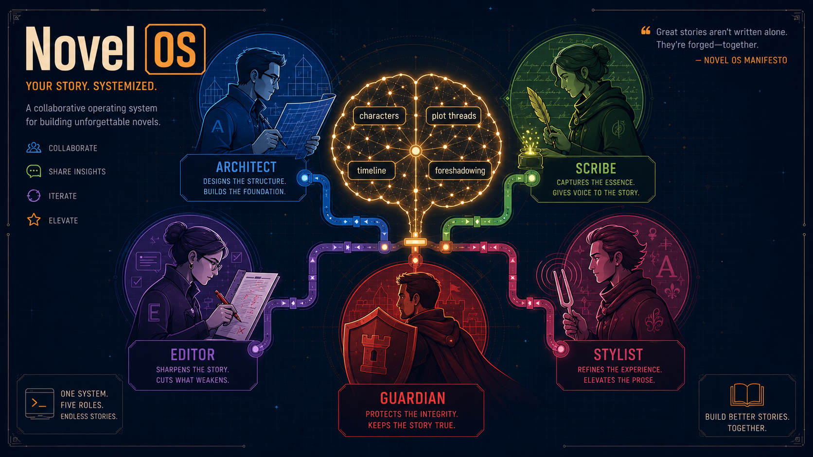
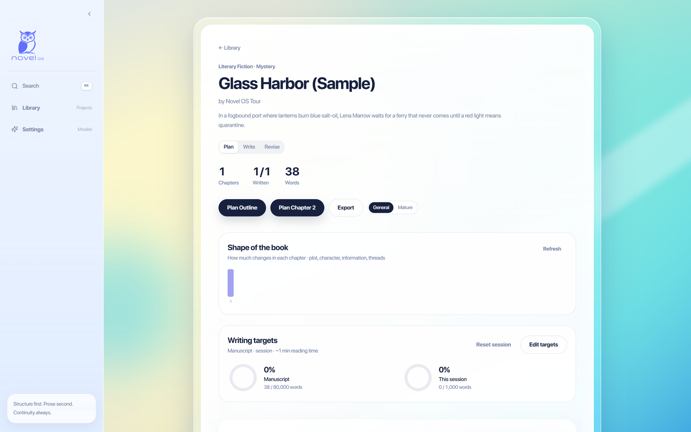
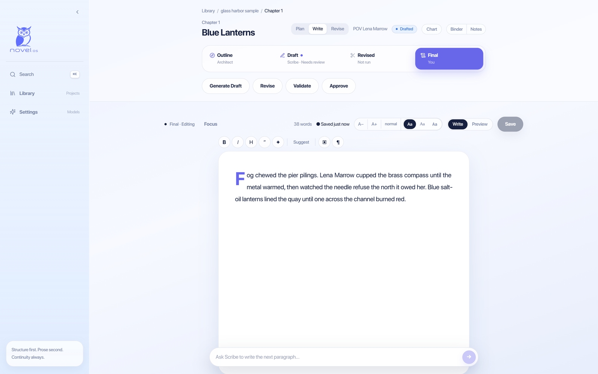
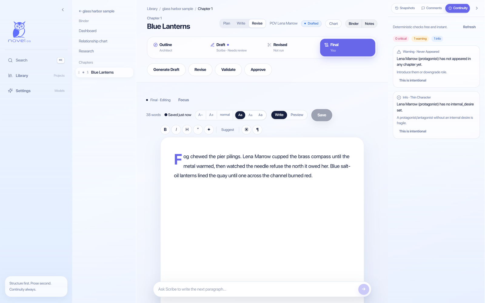
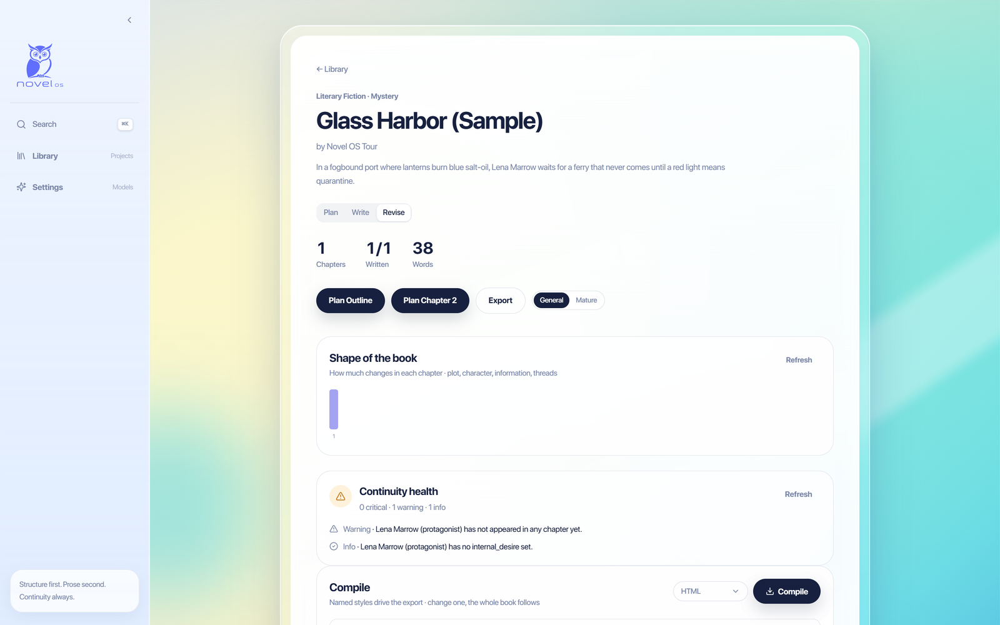
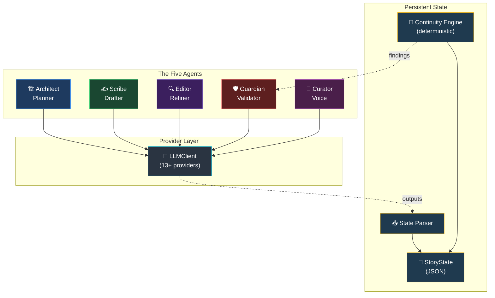
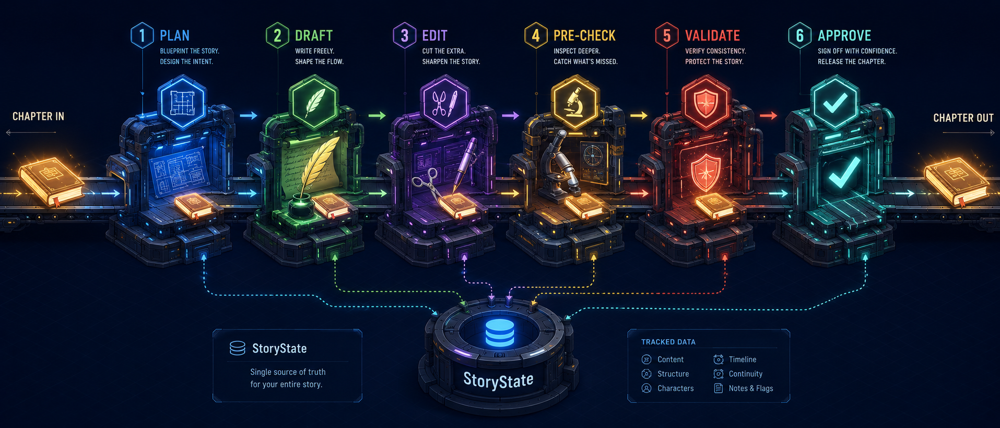
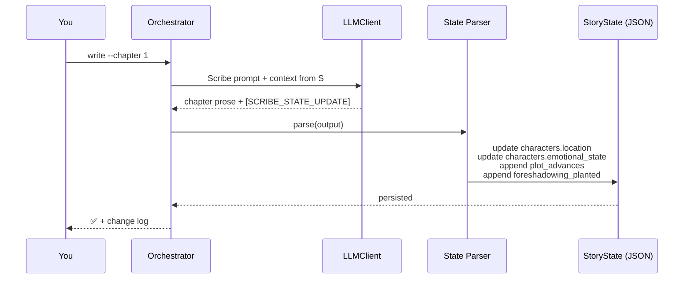
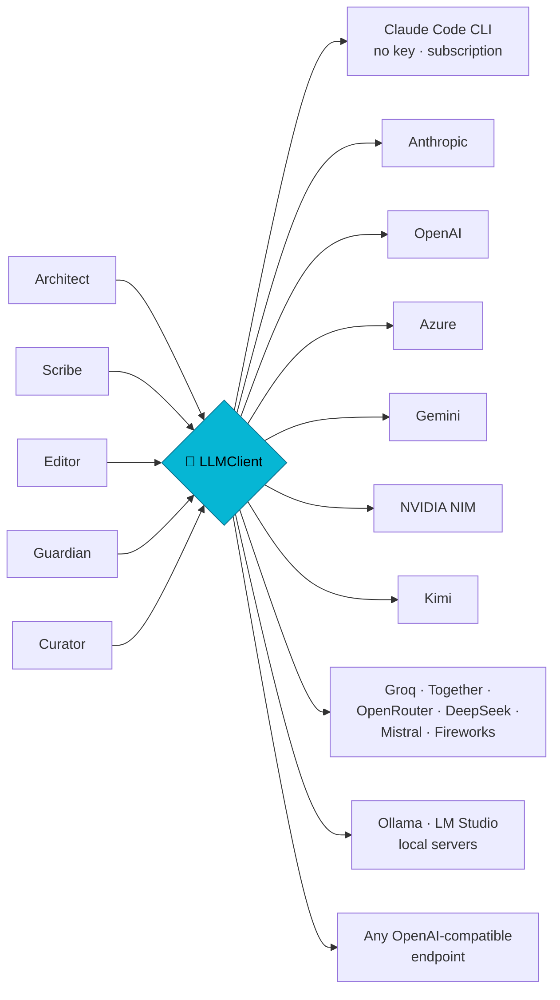

<div align="center">
  
</div>

<div align="center">
<h3>A Writing Studio with a Story Model That Knows When an Edit Breaks the Book</h3>

<p><em>Scrivener's structure, Word's editing surface, and an agent pipeline that remembers chapter 3.</em></p>

<br/>

[](https://python.org)
[](LICENSE)
[]()
[]()
[]()
[]()

<br/>

```
╔══════════════════════════════════════════════════════════════════╗
║                                                                  ║
║   "The difference between an amateur and a professional          ║
║    writer is a systematic process."                              ║
║                                                                  ║
║                              Novel OS Philosophy               ║
╚══════════════════════════════════════════════════════════════════╝
```

</div>

---

## 🌟 What is Novel OS?

**Novel OS** is a complete **editorial infrastructure** for producing professional-quality novels using multiple specialized AI agents working in concert with any LLM you choose (Claude, GPT, Gemini, Llama, Kimi, local models, anything OpenAI-compatible).

Traditional AI writing generates one response and forgets everything. Novel OS is different:

- 🧠 **Persistent memory** agent outputs are parsed and merged into a central state file. Characters, locations, plot threads, foreshadowing, and quality scores accumulate chapter by chapter.
- 🤝 **Agents collaborate** Architect → Scribe → Editor → Guardian → Curator, each handing off to the next with full context.
- 🛡️ **Deterministic + LLM validation** a free local continuity engine catches dormant threads, unresolved foreshadowing, and timeline drift *before* the LLM Guardian runs.
- 🔌 **Provider-agnostic** Anthropic, OpenAI, Azure, Gemini, NVIDIA NIM, Kimi, Groq, Together, OpenRouter, DeepSeek, Mistral, Fireworks, Ollama, LM Studio, or any OpenAI-compatible endpoint.

> Think of it as hiring a **full-time editorial team** story architect, prose craftsman, line editor, fact-checker, voice coach all working on your novel around the clock, on infrastructure that actually remembers what happened in chapter 3.

<p align="center"></p>

---

## 🖼️ The Studio

Novel OS is a **writing studio**, not just a CLI. The engine still runs headless the command line is a first-class way to use it but the day-to-day surface is a browser app with a real manuscript editor.

### Three modes, not four stages

Writers move between **planning, writing and revising** constantly, and rarely in order. The mode switch (`⌘1` `⌘2` `⌘3`) re-lays out the whole studio around whichever one you're in. The pipeline's four stages still exist, but as *provenance* where a paragraph came from rather than as a workflow you're supposed to march through.

<p align="center"></p>

**Plan** leads with structure the shape-of-the-book strip, the outliner, the Codex and the relationship chart.

### Write mode gets out of the way

<p align="center"></p>

Both rails collapse, continuity runs silently, and **nothing volunteers itself** no ghost text, no hovering suggestions, no token meter. Select a passage and a single bar appears with the only four things worth doing to it. That's the whole AI surface while you're drafting.

### Revise shows you the book as it is

<p align="center"></p>

The Inspector opens on continuity with real findings and here's the part that matters **"This is intentional."** A checker can't tell an unreliable narrator from a mistake, so every finding can be dismissed with a reason that persists into `story_state.json`. The Guardian reads those exemptions too, so the AI never re-litigates a call you've already made.

<p align="center"></p>

Compile lives here too: named styles drive the export, so you change what "Block Quote" means once and the whole book follows.

---

## 🏛️ Architecture


```mermaid
graph TB
    subgraph Agents["The Five Agents"]
        A["🏗️ Architect<br/>Planner"]
        B["✍️ Scribe<br/>Drafter"]
        E["🔍 Editor<br/>Refiner"]
        G["🛡️ Guardian<br/>Validator"]
        S["🎨 Curator<br/>Voice"]
    end

    subgraph Memory["Persistent State"]
        SM["🧠 StoryState<br/>(JSON)"]
        SP["📥 State Parser"]
        CE["🔬 Continuity Engine<br/>(deterministic)"]
    end

    subgraph LLM["Provider Layer"]
        LC["🔌 LLMClient<br/>(13+ providers)"]
    end

    A & B & E & G & S --> LC
    LC -.outputs.-> SP
    SP --> SM
    CE --> SM
    CE -.findings.-> G

    style A fill:#1e3a5f,stroke:#4a9eff,color:#fff
    style B fill:#1a4731,stroke:#4ade80,color:#fff
    style E fill:#3b1f5e,stroke:#a78bfa,color:#fff
    style G fill:#5e1f1f,stroke:#f87171,color:#fff
    style S fill:#4a1f4a,stroke:#e879f9,color:#fff
    style SM fill:#1f3a4f,stroke:#fbbf24,color:#fff
    style SP fill:#1f3a4f,stroke:#fbbf24,color:#fff
    style CE fill:#1f3a4f,stroke:#fbbf24,color:#fff
    style LC fill:#2a3441,stroke:#06b6d4,color:#fff
```

---

## 🎭 The Five Agents

| # | Agent | Role | Outputs |
|---|---|---|---|
| 1 | 🏗️ **Architect** | Story planner designs 3-act structure, character arcs, beats | `outline.json`, expanded `chapter_NNN_outline.md` |
| 2 | ✍️ **Scribe** | Prose drafter writes the chapter in deep POV | `chapter_NNN_draft.md` + `[SCRIBE_STATE_UPDATE]` block |
| 3 | 🔍 **Editor** | Line surgeon 5 modes: line / developmental / pacing / dialogue / tension | `chapter_NNN_revised.md` + `[EDITOR_STATE_UPDATE]` with before/after scores |
| 4 | 🛡️ **Guardian** | Forensic fact-checker character, timeline, world, plot continuity | `chapter_NNN_continuity_report.md` with `Status: PASS/WARNING/FAIL` |
| 5 | 🎨 **Curator** | Voice stylist locks tone, prose rhythm, genre conventions | `[STYLE_STATE_UPDATE]` with consistency / genre / voice scores |

Every agent prompt now includes a strict **OUTPUT CONTRACT** that forces the LLM to emit machine-parseable update blocks verified working with frontier models (Claude, GPT) and open-weight models (Llama 3.3 70B).

---

## 🔄 The Chapter Workflow


```mermaid
flowchart LR
    P["🏗️ PLAN<br/>Architect"] --> D["✍️ DRAFT<br/>Scribe"]
    D --> Px1["📥 Parse +<br/>persist"]
    Px1 --> Ed["🔍 EDIT<br/>Editor"]
    Ed --> Px2["📥 Parse +<br/>persist"]
    Px2 --> CE["🔬 PRE-CHECK<br/>Continuity Engine"]
    CE --> V["🛡️ VALIDATE<br/>Guardian"]
    V --> Px3["📥 Parse +<br/>persist"]
    Px3 --> Ap["✅ APPROVE<br/>(gates FAIL)"]
    Ap -->|"Next ↺"| P

    style P fill:#1e3a5f,stroke:#4a9eff,color:#fff
    style D fill:#1a4731,stroke:#4ade80,color:#fff
    style Ed fill:#3b1f5e,stroke:#a78bfa,color:#fff
    style CE fill:#1f3a4f,stroke:#fbbf24,color:#fff
    style V fill:#5e1f1f,stroke:#f87171,color:#fff
    style Ap fill:#1a4731,stroke:#22c55e,color:#fff
    style Px1 fill:#2a3441,stroke:#06b6d4,color:#fff
    style Px2 fill:#2a3441,stroke:#06b6d4,color:#fff
    style Px3 fill:#2a3441,stroke:#06b6d4,color:#fff
```

**Quality gates** a chapter cannot be approved while `Status: FAIL` is on file. Resolve the issue and re-validate.

<p align="center"></p>

---

## 🧠 Persistent Memory How State Actually Lives

The defining feature: **every agent's structured output is parsed and merged into a central JSON state**, so subsequent agents see what came before.


```mermaid
sequenceDiagram
    participant U as You
    participant O as Orchestrator
    participant L as LLMClient
    participant P as State Parser
    participant S as StoryState (JSON)

    U->>O: write --chapter 1
    O->>L: Scribe prompt + context from S
    L-->>O: chapter prose + [SCRIBE_STATE_UPDATE]
    O->>P: parse(output)
    P->>S: update characters.location<br/>update characters.emotional_state<br/>append plot_advances<br/>append foreshadowing_planted
    S-->>O: persisted
    O-->>U: ✅ + change log
```

Captured per chapter: character locations, emotional states, last-appearance index, key events, foreshadowing planted/resolved, new information revealed, editor quality scores (before/after), continuity status & issues, style scores.

---

## 🔬 The Continuity Engine

Deterministic, free, instant runs before the LLM Guardian on every `validate`, and on demand via `check`.

| Check | Severity | Catches |
|---|---|---|
| `dormant_thread` | warning | Active plot threads idle >3 chapters |
| `overdue_thread` | **critical** | Threads past their `target_resolution_chapter` still active |
| `unresolved_foreshadowing` | warning | Planted seeds with no matching `resolved` entry |
| `absent_character` | warning | Main characters silent >5 chapters |
| `never_appeared` | warning | Protagonists/antagonists who never showed up |
| `dead_character_state` | warning | Flagged-dead characters with active state |
| `missing_chapter_file` | **critical** | Chapter marked complete but no manuscript file |
| `status_drift` | info | Draft exists but status still `planned` |
| `thin_character` | info | Main characters with no `internal_desire` set |
| `relationship_orphan` | warning | A bond pointing at someone who isn't in the cast |
| `hostile_pair_co_present` | warning | Enemies sharing a scene with no acknowledgement |
| `relationship_since_anachronism` | warning | A bond that starts before the people meet |
| `contradictory_relationship` | warning | Two bonds that can't both be true |
| `dead_bonded_co_presence` | **critical** | A dead character still turning up in scenes |
| `stalled_middle` | warning | See below the one nobody else checks for |

```bash
python core/orchestrator.py check                 # check whole project
python core/orchestrator.py check --chapter 12    # check as-of a specific chapter
```

Findings are also injected into the LLM Guardian's prompt as context the Guardian gets a head start instead of rediscovering obvious issues, and you don't spend tokens on them.

### Every finding can be wrong and you can say so

A checker cannot tell an unreliable narrator, deliberate foreshadowing, or a character who *lies* from a genuine mistake. So each finding carries **"This is intentional"**, with a reason, persisted into `story_state.json` and keyed to the *fact* rather than the wording so a dismissal survives rewordings and re-sightings. The filter lives in the engine, which means the panel, the CLI and the Guardian all agree.

Without that, a continuity panel re-raises the same non-error every run until you stop reading it and a check you ignore is worth less than no check at all.

### The sagging middle, measured

Middles are where books die, and the failure has a shape: **the protagonist goes reactive** things happen *to* them and they stop pursuing anything. That sounds subjective, but it decomposes into things the state already records per chapter plot advances, character development, emotional beats, new information, threads touched.

A chapter that changes none of them didn't move the story. Three consecutive such chapters are the sag. Entirely deterministic **no model is asked whether your book drags** and shown as a shape-of-the-book strip, one bar per chapter, with sagging runs named in plain language.

---

## 🔌 Provider-Agnostic LLM Layer

Pick any of these auto-detected from whichever API key is present:

| Provider | `NOVEL_OS_LLM_PROVIDER` | Key env var |
|---|---|---|
| **Claude Code CLI (no API key free with your subscription)** | `claude_cli` | (just `claude login`) |
| Anthropic Claude | `anthropic` | `ANTHROPIC_API_KEY` |
| OpenAI | `openai` | `OPENAI_API_KEY` |
| Azure OpenAI | `azure` | `AZURE_OPENAI_API_KEY` + `AZURE_OPENAI_ENDPOINT` |
| Google Gemini | `gemini` | `GEMINI_API_KEY` |
| NVIDIA NIM | `nvidia` | `NVIDIA_API_KEY` |
| Kimi / Moonshot | `kimi` | `KIMI_API_KEY` |
| Groq | `groq` | `GROQ_API_KEY` |
| Together AI | `together` | `TOGETHER_API_KEY` |
| OpenRouter | `openrouter` | `OPENROUTER_API_KEY` |
| DeepSeek | `deepseek` | `DEEPSEEK_API_KEY` |
| Mistral | `mistral` | `MISTRAL_API_KEY` |
| Fireworks | `fireworks` | `FIREWORKS_API_KEY` |
| Ollama (local) | `ollama` | |
| LM Studio (local) | `lmstudio` | |
| **Any OpenAI-compatible endpoint** | `openai_compatible` | `NOVEL_OS_API_KEY` + `NOVEL_OS_BASE_URL` |


```mermaid
graph LR
    A[Architect] & B[Scribe] & E[Editor] & G[Guardian] & S[Curator] --> LC{🔌 LLMClient}
    LC --> P0[Claude Code CLI<br/>no key · subscription]
    LC --> P1[Anthropic]
    LC --> P2[OpenAI]
    LC --> P3[Azure]
    LC --> P4[Gemini]
    LC --> P5[NVIDIA NIM]
    LC --> P6[Kimi]
    LC --> P7[Groq · Together ·<br/>OpenRouter · DeepSeek ·<br/>Mistral · Fireworks]
    LC --> P8[Ollama · LM Studio<br/>local servers]
    LC --> P9[Any OpenAI-compatible<br/>endpoint]

    style LC fill:#06b6d4,stroke:#0e7490,color:#000
```

---

## 🚀 Quick Start

```bash
git clone https://github.com/mrigankad/Novel-OS.git
cd Novel-OS
pip install -r requirements.txt   # install only the SDKs you need
```

### 0 Configure your LLM (one command)

Let the setup wizard detect what you already have the Claude Code CLI, any API
key, or a local model server test the connection, and write your `.env` for you:

```bash
python core/orchestrator.py setup        # or: python -m core.setup_wizard
```

> **No API key?** If you have the [Claude Code CLI](https://docs.claude.com/claude-code)
> installed and `claude login` done, Novel OS runs entirely on your subscription —
> the wizard picks it automatically, and there are zero per-token API charges.

Prefer to configure by hand? `cp .env.example .env` and set your key(s). If you run a
writing command with nothing configured, Novel OS offers the wizard automatically.

### 1 Initialize

```bash
python core/orchestrator.py init --title "The Last Signal" --genre "Sci-Fi Thriller"
```

### 2 Cast

```bash
python core/orchestrator.py character add --name "Lena Vasquez" --role protagonist
python core/orchestrator.py character add --name "Director Malk" --role antagonist
```

### 3 Plan

```bash
python core/orchestrator.py plan outline --chapters 32
python core/orchestrator.py plan chapter --number 1 --pov "Lena Vasquez"
```

### 4 Write, edit, validate

```bash
python core/orchestrator.py write --chapter 1                     # Scribe drafts
python core/orchestrator.py edit  --chapter 1 --mode line         # Editor polishes
python core/orchestrator.py check --chapter 1                     # free pre-check
python core/orchestrator.py validate --chapter 1                  # Guardian validates
python core/orchestrator.py approve  --chapter 1                  # gates on FAIL
```

Every phase command also accepts `--dry-run` to emit the prompt without calling the LLM useful for hand-running in a chat UI.

### 5 Track & export

```bash
python core/orchestrator.py status
python core/orchestrator.py export --format markdown
```

---

## 🖥️ Running the Studio

Two processes the API and the React app:

```bash
# 1. Backend (from repo root)
pip install -r requirements.txt
export NOVEL_OS_PROJECTS_DIR=./projects   # folder of project dirs
export NOVEL_OS_MEDIA_DIR=./media         # uploaded images (default ./media)
uvicorn api.main:app --reload --port 8000

# 2. Frontend (in another terminal)
cd web && npm install && npm run dev      # http://localhost:5173
```

Each project is a folder under `NOVEL_OS_PROJECTS_DIR` containing
`outputs/state/story_state.json` created by `python core/orchestrator.py init …`,
or by **New Manuscript** in the app. There's a sample project on first run if you
just want to look around.

| Env var | Purpose |
|---|---|
| `NOVEL_OS_PROJECTS_DIR` | Where projects live (default `./projects`) |
| `NOVEL_OS_MEDIA_DIR` | Uploaded images (default `./media`) |
| `NOVEL_OS_DB` | SQLite by default; Postgres by changing the URL |
| `NOVEL_OS_CORS_ORIGINS` | Comma-separated browser origins (default: Vite's 5173 and 5174) |

### What's in the studio

| | |
|---|---|
| ✍️ **Rich-text manuscript** | ProseMirror surface with inline images, anchored comments, and a markdown projection the agents read |
| 📝 **Track changes** | Suggest mode turns typing into proposals and deletion into struck text; accept/reject per change or in bulk |
| 🗂️ **Binder · Corkboard · Outliner** | Scrivener-shaped structure, with AI-computed tension/emotion/pace columns |
| 🧭 **Codex** | Typed world entries characters, locations, worldbuilding, items with portraits and a relationship chart |
| ✨ **Auto-extract** | Import a finished manuscript and the cast is *proposed* to you, not re-typed by you |
| 📐 **Shape of the book** | Per-chapter movement, with sagging runs flagged |
| ↯ **Consequence preview** | Rewrite a passage and see what it breaks *before* accepting |
| 📤 **Compile** | DOCX · EPUB · HTML · Markdown, driven by named styles |
| ⌨️ **Keyboard-first** | `⌘K` palette · `⌘1/2/3` modes · `⌘.` quick note without leaving the page |

---

## 🗂️ CLI Reference

| Command | Purpose |
|---|---|
| `init --title --genre [--author]` | Bootstrap a new project |
| `character add --name --role` | Add a character (`protagonist`/`antagonist`/`supporting`/`minor`) |
| `character list` | List all characters with arc state |
| `plot add --name --description [--type --priority]` | Register a plot thread |
| `plot list` | List threads by priority and status |
| `plan outline --chapters --words` | Generate act structure |
| `plan chapter --number [--pov --summary] [--dry-run]` | Architect expands the chapter |
| `write --chapter [--draft-file --dry-run]` | Scribe drafts (or accept a file) |
| `edit --chapter --mode [--dry-run]` | Editor revises in one of 5 modes |
| `validate --chapter [--dry-run]` | Pre-check + LLM Guardian validates |
| `check [--chapter N]` | Deterministic engine only (no LLM) |
| `approve --chapter` | Mark complete (blocked while `Status: FAIL`) |
| `status` | Project dashboard |
| `export --format markdown` | Compile approved chapters |

---

## 📁 Project Structure

```
novel-os/
├── 📄 README.md                       ← you are here
├── 📄 AGENTS.md                       ← full agent specs
├── 📄 SYSTEM_OVERVIEW.md              ← architecture deep-dive
├── 📄 requirements.txt
├── 📄 .env.example                    ← provider configuration
│
├── 🐍 core/                           ← the engine (file-based, no web deps)
│   ├── orchestrator.py                ← CLI + workflow
│   ├── state_manager.py               ← persistent JSON state
│   ├── llm_client.py                  ← 13+ provider abstraction
│   ├── state_parser.py                ← agent output → state mutations
│   ├── continuity_engine.py           ← 12 deterministic checks
│   ├── stall_detector.py              ← sagging-middle detection
│   ├── codex_extract.py               ← propose Codex entries from prose
│   ├── context_pack.py                ← ranked, budgeted agent context
│   ├── consequence.py                 ← ripple of a proposed rewrite
│   ├── document_tree.py               ← binder (parts / chapters / scenes)
│   ├── styles.py                      ← named compile styles
│   ├── compile_book.py                ← gather → render
│   ├── compile_docx.py                ← OOXML, no dependency
│   └── compile_epub.py                ← EPUB 3, no dependency
│
├── ⚡ api/                            ← FastAPI: the studio's backend
│   ├── routes.py · services.py        ← HTTP → ProjectService → engine
│   ├── db.py                          ← SQLModel (SQLite / Postgres)
│   ├── richtext.py                    ← ProseMirror ⇄ markdown
│   ├── media.py                       ← content-addressed image store
│   └── jobs.py                        ← agents never run inside a request
│
├── ⚛️ web/                            ← React 19 · Vite · Tailwind v4 · TipTap
│   └── src/{routes,components,lib,hooks}
│
├── 🤖 agents/                         ← each has prompt.md with OUTPUT CONTRACT
│   ├── architect/
│   ├── scribe/
│   ├── editor/
│   ├── continuity_guardian/
│   └── style_curator/
│
├── 📋 templates/                      ← story bible / character / outline starters
├── 📚 docs/                           ← WORKFLOWS.md, API.md
├── 🎬 examples/                       ← demo project + recent smoke run
├── 🎨 assets/                         ← mascot + optional generated imagery
│
└── 📤 outputs/                        ← (per project, gitignored)
    ├── state/story_state.json
    ├── manuscript/
    └── feedback/
```

---

## 💡 Why Novel OS Works

Great novels are not written they are **engineered**. Professional authors use editors, fact-checkers, and style guides. They maintain character bibles, plot trackers, and timelines. Novel OS gives every writer that infrastructure, automated and systematic, **with state that actually accumulates** rather than dissolving between sessions.

| ❌ Without Novel OS | ✅ With Novel OS |
|---|---|
| Characters forget their backstory | Persistent character database with location, emotion, knowledge |
| Plot holes emerge 200 pages in | Continuity engine catches dormant threads & overdue resolutions |
| Style drifts between chapters | Curator scores and flags voice drift per chapter |
| Foreshadowing dropped silently | Planted/resolved tracked; orphans surfaced |
| Tension collapses in act two | Architect beats + Editor tension mode enforce escalation |
| Vendor lock-in to one LLM | 13+ providers, swap with one env var |

---

## 📖 Documentation

| Document | What's inside |
|---|---|
| [PLAN.md](PLAN.md) | The phase board what's shipped, what's next, and the competitive reasoning |
| [AGENTS.md](AGENTS.md) | Full system prompts and OUTPUT CONTRACT for each of 5 agents |
| [SYSTEM_OVERVIEW.md](SYSTEM_OVERVIEW.md) | Architecture deep-dive and design rationale |
| [docs/ARCHITECTURE.md](docs/ARCHITECTURE.md) | Layers, the two stores, and the ingest bridge between them |
| [docs/WORKFLOWS.md](docs/WORKFLOWS.md) | Step-by-step writing workflows |
| [docs/API.md](docs/API.md) | Programmatic API for custom integrations |

### Design notes

Longer-form reasoning behind the product decisions:

| Note | What it argues |
|---|---|
| [Author's workflow & UX flow](docs/superpowers/specs/2026-08-08-authors-workflow-and-ux-flow.md) | The 35 jobs writing a novel involves, where writers actually stall, and the interaction design that follows including the uncomfortable finding that authors use AI for research and editing far more than for drafting prose |
| [Full-stack architecture](docs/superpowers/plans/2026-08-08-full-stack-architecture-and-buildout.md) | Where every byte lives, and an explicit list of what deliberately **does not** belong in the system |

---

<div align="center">

**Novel OS** *Write novels like a professional author, with an entire editorial team at your command.*

*Deterministic continuity · pipeline provenance · consequence preview · MIT License*

</div>
