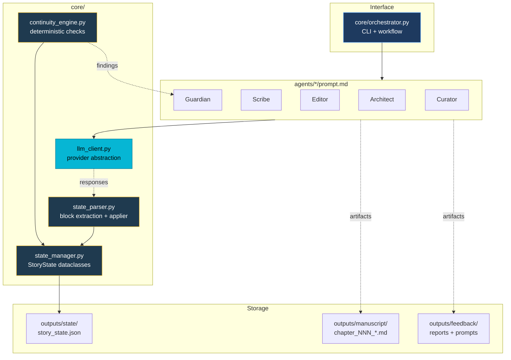
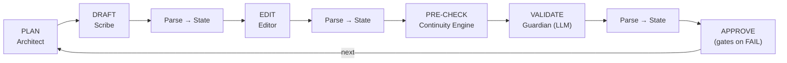

# 🎭 Novel OS — System Overview

A production-grade multi-agent fiction writing framework.

---

## Mission

Novel OS exists to make AI-assisted novel writing **stateful**, **provider-agnostic**, and **auditable**. It treats a novel like a build pipeline: discrete agents do specialised passes, every pass mutates a central state file, deterministic checks gate progression, and any LLM provider can sit behind the prompts.

---

## Architecture at a Glance



---

## The Five Agents

| # | Agent | Purpose | Output blocks parsed back to state |
|---|---|---|---|
| 1 | 🏗️ **Architect** | Story planning, 3-act structure, beats, chapter outlines | (none — produces outline files) |
| 2 | ✍️ **Scribe** | Drafts prose in deep POV | `[SCRIBE_STATE_UPDATE]` → characters_present, key_events, emotional_shifts, foreshadowing |
| 3 | 🔍 **Editor** | Five modes: line / developmental / pacing / dialogue / tension | `[EDITOR_STATE_UPDATE]` → quality_score_before/after |
| 4 | 🛡️ **Continuity Guardian** | Character / timeline / world / plot validation | `[CONTINUITY_REPORT]` + `[CONTINUITY_STATE_UPDATE]` → status, critical_issues, warnings, updated_character_positions, new_facts |
| 5 | 🎨 **Style Curator** | Voice consistency, genre adherence, prose rhythm | `[STYLE_STATE_UPDATE]` → consistency_score, genre_adherence, voice_strength |

Each agent prompt ends with a strict **OUTPUT CONTRACT** that forces the LLM to emit machine-parseable blocks. Verified working with frontier models (Claude, GPT) and open-weight models (Llama 3.3 70B via NVIDIA NIM).

---

## Persistent State

The `StoryState` (`core/state_manager.py`) is a single JSON document tracking:

- **Story bible** — genre, themes, tone, setting, world rules
- **Characters** — desires, fears, arcs, knowledge, possessions, current location, emotional state, last appearance
- **Plot threads** — type, priority, status, milestones, foreshadowing planted, target resolution chapter
- **Chapters** — POV, status, word count, scenes, plot advances, emotional beats, foreshadowing in/out, continuity check results, quality scores
- **Timeline** — chronological event log
- **Style profile** — POV, tense, prose style, sentence-length targets, vocabulary level, ratios
- **Session log** — every state-mutating action

Atomic writes with `.bak` rollback (Windows-safe via `os.replace`).

---

## Chapter Workflow



Each LLM call goes through `core/llm_client.py` (provider-agnostic). Each response is fed to `core/state_parser.py`, which extracts `[*_STATE_UPDATE]` blocks and mutates the central state. The deterministic `core/continuity_engine.py` runs before the LLM Guardian to catch obvious issues for free and seed the Guardian's prompt.

---

## LLM Provider Layer

`core/llm_client.py` resolves a provider from environment in this order:

1. `NOVEL_OS_LLM_PROVIDER` env var (explicit)
2. First native key found: `ANTHROPIC_API_KEY` → `OPENAI_API_KEY` → `AZURE_OPENAI_API_KEY` → `GEMINI_API_KEY`
3. First OpenAI-compatible alias key: NVIDIA, Kimi, Groq, Together, OpenRouter, DeepSeek, Mistral, Fireworks
4. Custom: `NOVEL_OS_BASE_URL` + `NOVEL_OS_API_KEY` for any other OpenAI-compatible endpoint

Native backends: Anthropic SDK, OpenAI SDK, Azure OpenAI client, google-genai. All other providers route through the OpenAI SDK with a custom `base_url`.

`.env` files are auto-loaded (with or without `python-dotenv` installed).

---

## Continuity Engine

Deterministic checks (`core/continuity_engine.py`) — free, instant, no LLM:

| Check | Severity | Default threshold |
|---|---|---|
| `dormant_thread` | warning | active thread not advanced in >3 chapters |
| `overdue_thread` | **critical** | active thread past `target_resolution_chapter` |
| `unresolved_foreshadowing` | warning | planted seed unmatched for >3 chapters |
| `absent_character` | warning | main character silent >5 chapters |
| `never_appeared` | warning | protagonist/antagonist with zero appearances |
| `dead_character_state` | warning | flagged-dead character with active state |
| `missing_chapter_file` | **critical** | chapter marked complete with no manuscript file |
| `status_drift` | info | draft exists but status still `planned` |
| `thin_character` | info | main character with no `internal_desire` |

Available as `python core/orchestrator.py check [--chapter N]` (exits 1 on any critical).

---

## Project Structure

```
novel-os/
├── README.md                       # quick start + provider matrix
├── AGENTS.md                       # five agent specs with output contracts
├── SYSTEM_OVERVIEW.md              # this file
├── requirements.txt
├── .env.example                    # provider configuration template
│
├── core/                           # all runtime code
│   ├── orchestrator.py             # CLI + workflow orchestration
│   ├── state_manager.py            # StoryState dataclasses + JSON persistence
│   ├── llm_client.py               # 13+ provider abstraction
│   ├── state_parser.py             # agent output block parser + applier
│   └── continuity_engine.py        # deterministic checks
│
├── agents/
│   ├── architect/prompt.md
│   ├── scribe/prompt.md
│   ├── editor/prompt.md
│   ├── continuity_guardian/prompt.md
│   └── style_curator/prompt.md
│
├── templates/                      # story bible, character, outline, chapter starters
├── docs/
│   ├── WORKFLOWS.md
│   └── API.md
├── examples/
│   ├── demo_project/               # canned worked example
│   └── last_smoke_run/             # most recent live-LLM artifacts (gitignored)
├── assets/                         # mascot + optional generated imagery
│
└── outputs/                        # (per project, gitignored)
    ├── state/story_state.json
    ├── manuscript/                 # drafts and revisions
    └── feedback/                   # reports and prompts
```

---

## Design Principles

- **State first**: the JSON is the source of truth. Everything else can be regenerated.
- **Provider neutral**: never hard-code a model. The agent prompts are providers-agnostic.
- **Cheap before expensive**: deterministic checks before LLM calls.
- **Auditable**: every prompt sent and response received is saved to disk.
- **Atomic edits**: state writes never corrupt on interruption.
- **Soft failure**: an LLM failure prints the prompt path so you can hand-run it; nothing is lost.

---

## Quick Start

```bash
git clone https://github.com/mrigankad/Novel-OS.git
cd Novel-OS
pip install -r requirements.txt
cp .env.example .env       # add your provider key

python core/orchestrator.py init --title "My Novel" --genre "Sci-Fi"
python core/orchestrator.py character add --name "Hero" --role protagonist
python core/orchestrator.py plan outline --chapters 32
python core/orchestrator.py plan chapter --number 1 --pov "Hero"
python core/orchestrator.py write --chapter 1
python core/orchestrator.py edit  --chapter 1 --mode line
python core/orchestrator.py validate --chapter 1
python core/orchestrator.py approve  --chapter 1
python core/orchestrator.py export
```

---

*Novel OS v1.1 | Production-Ready Fiction Framework | MIT License*
